# Követelményspecifikáció

## A feladat neve

### Mobil szoftverfejlesztés házi feladat

## Feladatkiírás

Olyan mobil alkalmazás készítése React Native alapokon, amelyben a felhasználók fel tudnak tölteni eladásra szánt termékeket, majd módosítani, törölni is lehetőségük van azokat.

## A fejlesztői csapat

| Csapattag neve | Neptun-kód |
| :- | :-: |
| Ujvári Veronika | ENFF9U |

## Részletes feladatleírás

-	Adatbázis, táblák megtervezése, Firebase (Backend as a Service) használata
-	Frontend létrehozása React Native segítségével
-	Autentikáció (bejelentkezés, regisztráció) megvalósítása
-	A termékekhez tartozó név, leírás, kategória és egyéb paraméterek rögzítése

## Technikai paraméterek

Az alkalmazás backendként a Firebase (Backend as a Service) szolgáltatást használja, frontend pedig a React Native segítségével kerül megvalósításra.

## Use-case-ek

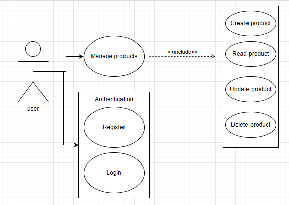
<br />*use case diagram [draw.io](https://draw.io)*

---

<div style="page-break-after: always"></div>

# Rendszerterv

## Tartalomjegyzék

  - [A rendszer célja, funkciói és környezete](#a-rendszer-célja-funkciói-és-környezete)
    - [Főbb funkciók](#főbb-funkciók)
  - [Felhasználói kézikönyv](#felhasználói-kézikönyv)
    - [Oldalak tervei](#terv)
    - [Elkészült alkalmazás](#elkészült-alkalmazás)
  - [Adatbázis architektúra](#adatbázis-architektúra)
  - [Telepítési leírás](#telepítési-leírás)
  - [A program készítése során felhasznált eszközök, technológiák](#a-program-készítése-során-felhasznált-eszközök-technológiák)
  - [Összefoglalás](#összefoglalás)
  - [Továbbfejlesztési lehetőségek](#továbbfejlesztési-lehetőségek)
  - [Irodalomjegyzék](#irodalomjegyzék)
    - [Hivatkozások](#hivatkozások)

---

## A rendszer célja, funkciói és környezete

### Főbb funkciók

&#x2611; jelzi ha implementálva van, &#9746; ha nem.

&#x2611; Regisztráció és belépés
&#x2611; Kijelentkezés
&#x2611; Termék hozzáadása frontenden keresztül (cím, termékleírás, kategória, állapot, ár megadásával)
&#x2611; Saját termék törlésének lehetősége
&#x2611; Saját termék módosításának lehetősége
&#x2611; Képfeltöltés termékhez
&#x2611; Összes termék megtekintése
&#x2611; Egy darab termék részletes megtekintése
&#x2611; Saját termékek megtekintése profil oldalon

---

## Felhasználói kézikönyv

Ez a fejezet a felhasználói leírást tartalmazza. Az összes releváns képernyő, funkció tervezete, majd megvalósított verziója is bemutatásra kerül.

### Terv

#### Regisztráció és bejelentkezés

Az alábbi képen a regisztráció oldala látható. Ha a felhasználó regisztrálni szeretne, e-mail címet és jelszavat szükséges megadnia. A bejelentkezési felület hasonlóan fog kinézni.

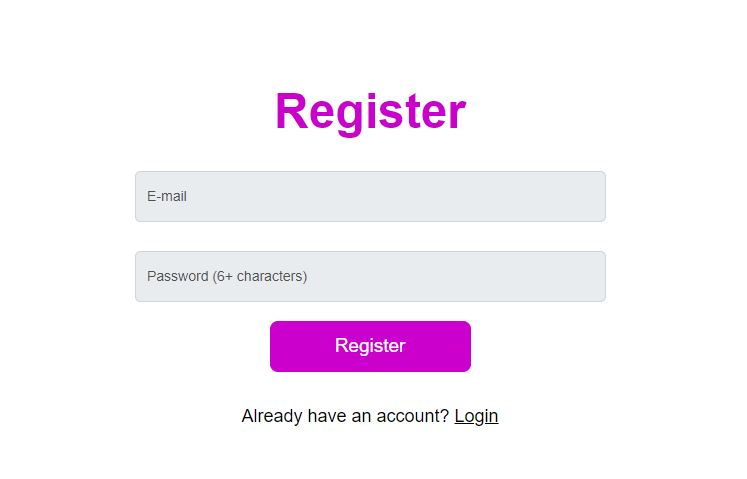


#### Termékek megtekintése

Ezen az oldalon a bejelentkezett felhasználó megtekintheti az összes terméket, az övét és más felhasználó által feltöltöttet is beleértve.

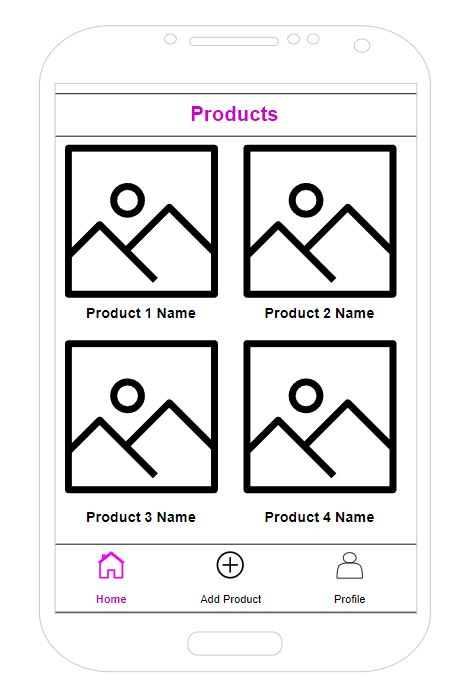

#### Egy termék megtekintése

Ha a bejelentkezett felhasználó egy termékre kattint, akkor megjelenik neki az adott termék oldala bővebb információkkal, pl. leírással, kategóriával, stb.

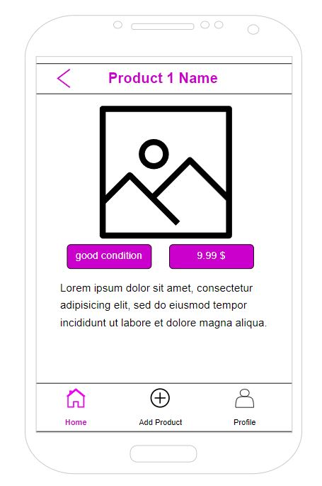

#### Saját termék feltöltése

A bejelentkezett felhasználó ezen az oldalon feltöltheti saját eladásra szánt termékeit. Cím, leírás, kategória, minőség és ár megadása szükséges.

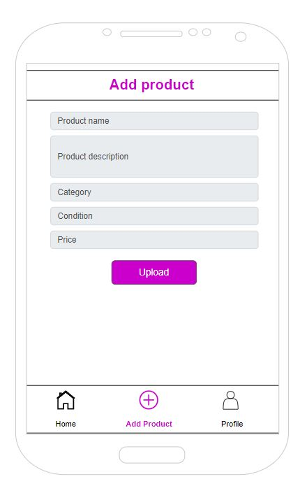

### Elkészült alkalmazás

#### Regisztráció és bejelentkezés

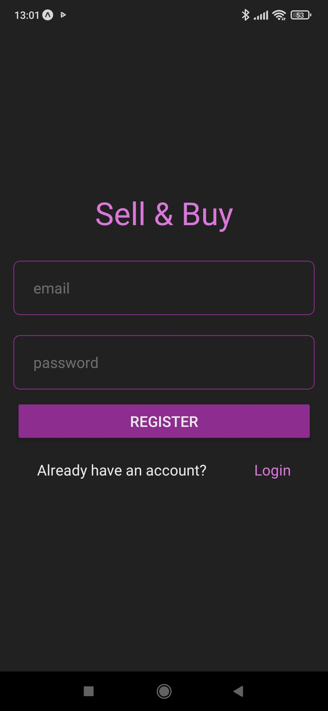

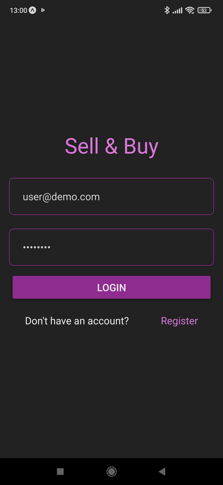

#### Kezdőképernyő

A kezdőképernyőn jelennek meg a termékek, amiket a felhasználók feltöltöttek.

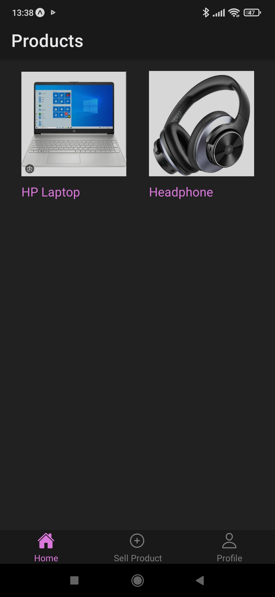

Egy termékre kattintva bejön annak a részletes oldala.

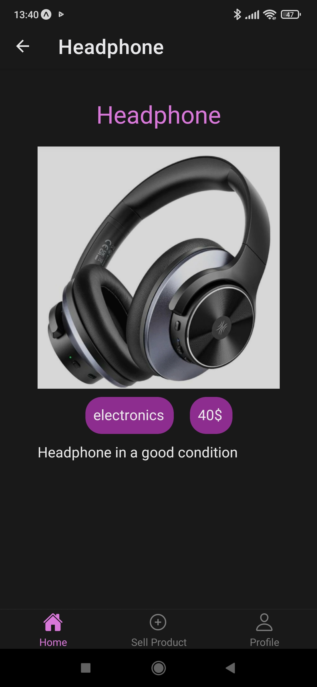

#### Termék feltöltése

Itt tölthetünk fel terméket. Kép kiválasztása kötelező. 

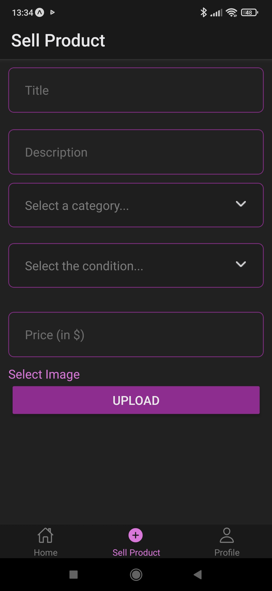

A kategória és a termék állapota legördülő listából választható ki.

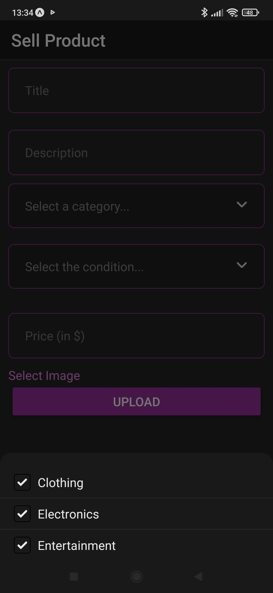

Ha képet nem választottunk ki, figyelmeztet az alkalmazás.

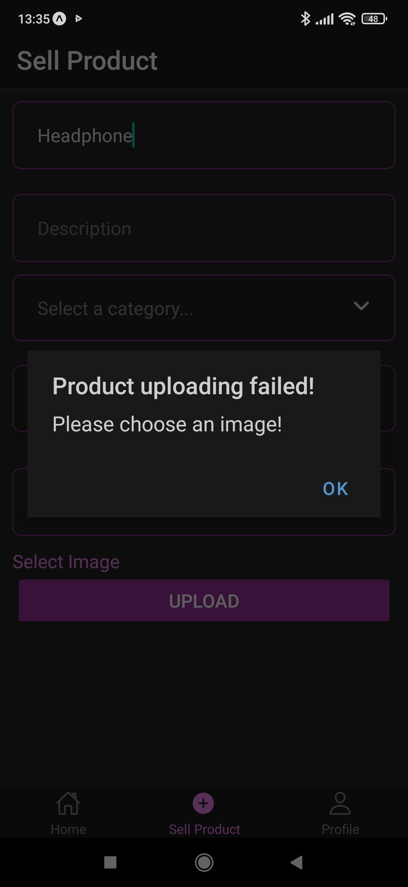

Kép kiválasztása után megjelenik a kép is, amely fel fog töltődni. Ha meggondolnánk magunkat, a Delete Image gombbal törölhető a kép, majd lehetőségünk van újat kiválasztani feltöltés előtt.

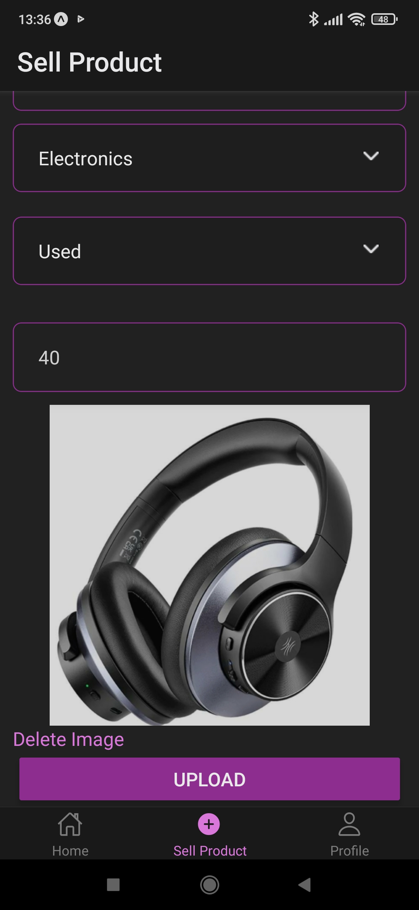

#### Profil

Ezen az oldalon saját termékeink jelennek meg. Jobb felső sarokban lévő Logout gombbal jelentkezhetünk ki az alkalmazásból.

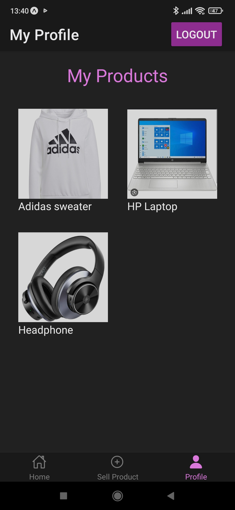

Egy termékre kattintva bejön annak a szerkesztési oldala. Itt a jobb felső sarokban található Delete gombbal lehetőségünk van törölni a termékünket. Alul az Update gombbal menthető a módosítás.

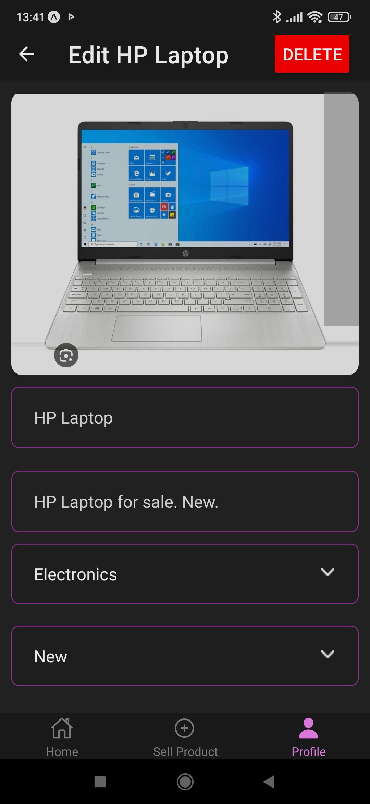

---

## Adatbázis architektúra

A Firebase felhőalapú adatbázisa, a Cloud Firestore lett használva.

Egy kollekciót (collection) hoztam létre, products néven, amely tárolja a feltöltött termékeket. Ennek felépítése a következőképpen néz ki:

| Mező neve | Leírás |
| :- | :-: |
| title | a termék neve |
| category | kategória |
| description | leírás |
| price | ár (dollárban) |
| condition | állapot |
| image | termékhez tartozó kép (azonosító + link) |
| userId | terméket feltöltő felhasználó azonosítója |
| createdAt | létrehozás dátuma |
| updatedAt | módosítás dátuma |

A képek a Firebase Storage-ba kerülnek feltöltésre.

---

## Telepítési leírás

Kipróbáláshoz klónozza le a projektet git segítségével.

Hozza létre a `.env` fájlt:

`cp .env.example .env`

Itt az alábbiak megadására van szükség:

```
apiKey=
authDomain=
projectId=
storageBucket=
messagingSenderId=
appId=
```

Ezeket az azonosítókat a Firebase-ben új projekt létrehozásakor kapjuk meg.

A következő parancs kiadásával futtatható a fejlesztői szerver:

`npx expo start`

Ha Androidos készüléken szeretnénk megnézni, akkor az Android Studio-t kell letöltenünk a gépünkre.

Ha az alkalmazásunkat okostelefonon szeretnénk kipróbálni, akkor az Expo Go telefonos alkalmazás letöltésére van szükség, ahol a QR kódot kell beolvasnunk.

---

## A program készítése során felhasznált eszközök, technológiák

Ebben a fejezetben a felhasznált eszközök, technológiák és a harmadik féltől származó csomagok kerülnek bemutatásra.

### React Native

Android és iOS alkalmazások fejlesztésére használják. Nyílt forráskodú.

### Firebase

A Google által biztosított felhőszolgáltatások és alkalmazásfejlesztési platformok készlete. Adatbázisokat, szolgáltatásokat, autentikációt és integrációt biztosít számos alkalmazáshoz.

### Csomagok

#### Expo Image Picker

Egy könyvtár, amely hozzáférést biztosít a rendszer felhasználói felületéhez. Segítségévle képeket és videókat választhatunk ki a telefon könyvtárából, vagy fényképet készíthetünk a telefon kamerájával.

#### Expo Secure Store

Olyan könyvtár, amely lehetőséget biztosít a kulcs-érték párok titkosítására és biztonságos tárolására helyileg az eszközön.

#### React Native Input Select

Teljesen testreszabható legördülő listát (Dropdown) biztosít.

---

## Összefoglalás

Elkészítettem egy olyan alkalmazást, amelyben lehetőség van termékek megtekintésére és saját termékek feltöltésére, szerkesztésére és törlésére. Az alkalmazás React Native-ban lett megírva, backendként pedig egy backend as a service felhőszolgáltatást használ, a Firebase-t. A termékek a Firebase Firestore adatbázisába, a képek pedig a Storage szolgáltatásba kerülnek feltöltésre. Ezen kívül a Firebase segítségével az autentikáció is könnyedén megvalósításra került.

---

## Továbbfejlesztési lehetőségek

Az alkalmazásban számos továbbfejlesztési lehetőség rejlik, azáltal pedig egy összetettebb, komplexebb eladás-vásárlás alkalmazás készíthető el. Egy ilyen lehetőség például, hogy a felhasználók más felhasználóktól vásárolhatnak termékeket és fizetésre is lenne lehetőségük valamely biztonságos szolgáltató segítségével.
Ezen kívül különböző keresőt és filter is bele lehet építeni az alkalmazásba, hogy könnyedén megtaláljuk azokat a termékeket, amelyeket meg szeretnénk vásárolni.
Vagy akár elmenteni a termékeket egy Kedvencek elnevezésű mappába, hogy aztán könnyen vissza tudjuk keresni és megvásárolni azokat.
Chat funkció is jól mutatna az alkalmazásban, hogy beszélgetni tudjunk egyes felhasználókkal és érdeklődni a termékekkel kapcsolatban, vagy több információt kérni a termékekről. 

---

## Irodalomjegyzék

### Hivatkozások

> React Native | A framework for building native apps using React. Url: [https://reactnative-dev](https://reactnative.dev)

> Firebase | App development platform. Url: [https://firebase.google.com/](https://firebase.google.com/)

> React Native Select | Fully customizable dropdown selection package. Url: [https://github.com/azeezat/react-native-select](https://github.com/azeezat/react-native-select)

> Expo Secure Store | Encrypt and securely store key-value pairs. Url: [https://docs.expo.dev/versions/latest/sdk/securestore/](https://docs.expo.dev/versions/latest/sdk/securestore/)

> Expo Image Picker | Selecting images and videos from the phone's library. Url: [https://docs.expo.dev/versions/latest/sdk/imagepicker/](https://docs.expo.dev/versions/latest/sdk/imagepicker/)
