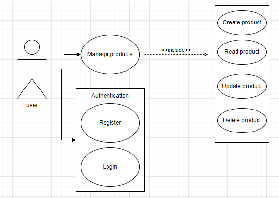

# Követelményspecifikáció

## A feladat neve

### Mobil szoftverfejlesztés házi feladat

## Feladatkiírás

Olyan mobil alkalmazás készítése React Native alapokon, amelyben a felhasználók fel tudnak tölteni eladásra szánt termékeket, majd módosítani, törölni is lehetőségük van azokat.

## A fejlesztői csapat

| Csapattag neve | Neptun-kód |
| :- | :-: |
| Ujvári Veronika | ENFF9U |

## Részletes feladatleírás

-	Adatbázis, táblák megtervezése, Firebase (Backend as a Service) használata
-	Frontend létrehozása React Native segítségével
-	Autentikáció (bejelentkezés, regisztráció) megvalósítása
-	A termékekhez tartozó név, leírás, kategória és egyéb paraméterek rögzítése

## Technikai paraméterek

Az alkalmazás backendként a Firebase (Backend as a Service) szolgáltatást használja, frontend pedig a React Native segítségével kerül megvalósításra.

## Use-case-ek

 *use case diagram [draw.io](https://draw.io)*

---

# Rendszerterv

## Tartalomjegyzék

  - [A rendszer célja, funkciói és környzete](#a-rendszer-célja-funkciói-és-környzete)
    - [Főbb funkciók](#főbb-funkciók)
  - [Felhasználói kézikönyv](#felhasználói-kézikönyv)
  - [Adatbázis architektúra](#adatbázis-architektúra)
  - [Telepítési leírás](#telepítési-leírás)
  - [A program készítése során felhasznált eszközök, technológiák](#a-program-készítése-során-felhasznált-eszközök-technológiák)
  - [Összefoglalás](#összefoglalás)
  - [Továbbfejlesztési lehetőségek](#továbbfejlesztési-lehetőségek)
  - [Irodalomjegyzék](#irodalomjegyzék)
    - [Hivatkozások](#hivatkozások)

---

## A rendszer célja, funkciói és környzete

### Főbb funkciók

Az alkalmazás minden funkcióját leírja. Legyen egyértelműen eldönthető, hogy az adott funkció implementálva van-e!

---

## Felhasználói kézikönyv

Felhasználói leírás. Az összes releváns képernyő, funkció bemutatása képekkel!

---

## Adatbázis architektúra

---

## Telepítési leírás

---

## A program készítése során felhasznált eszközök, technológiák

---

## Összefoglalás

---

## Továbbfejlesztési lehetőségek

---

## Irodalomjegyzék

### Hivatkozások

> React Native | A framework for building native apps using React. url: [https://reactnative-dev](https://reactnative.dev)
